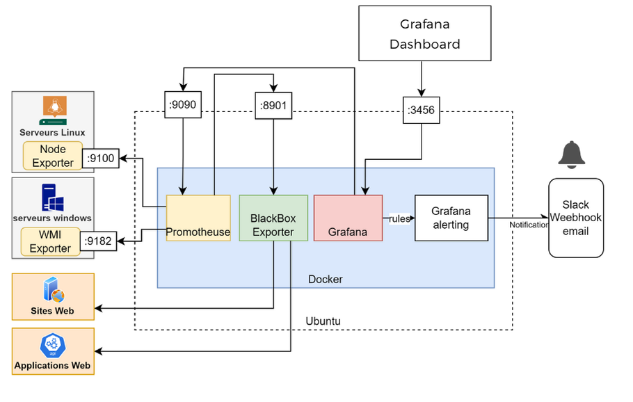

# Prometheus & Grafana Monitoring Solution

## Architecture Overview



Our monitoring solution consists of the following components:

### Core Components
- **Prometheus** (Port 9090): Main monitoring and metrics collection
- **Grafana** (Port 3000): Visualization and dashboarding
- **AlertManager** (Port 9093): Alert handling and routing
- **Blackbox Exporter** (Port 9115): External endpoint monitoring

### Exporters
- **Node Exporter** (Port 9100): Linux system metrics
- **WMI Exporter** (Port 9182): Windows system metrics

### Infrastructure
- Ubuntu Server as the main monitoring server
- Docker for containerization
- Docker Compose for service orchestration

### Alert Channels
- Slack notifications via webhooks
- Email alerts (optional)

## Port Overview
| Component | Port | Description |
|-----------|------|-------------|
| Prometheus | 9090 | Metrics collection and storage |
| Grafana | 3000 | Dashboard interface |
| AlertManager | 9093 | Alert management |
| Node Exporter | 9100 | Linux metrics collection |
| WMI Exporter | 9182 | Windows metrics collection |
| Blackbox Exporter | 9115 | Endpoint monitoring |

## Quick Start

1. Clone this repository:
```bash
git clone https://github.com/manarHM17/Prometheus_Grafana.git
cd Prometheus_Grafana
```

2. Copy and configure environment variables:
```bash
cp .env.example .env
# Edit .env with your configurations
```

3. Start the monitoring stack:
```bash
docker-compose up -d
```

4. Access the interfaces:
- Prometheus: http://${IP_ADDRESS}:9090
- Grafana: http://${IP_ADDRESS}:3000
- AlertManager: http://${IP_ADDRESS}:9093

## Documentation


- [Troubleshooting](docs/TROUBLESHOOTING.md)

### Component Documentation

- [Installation Guide](docs/INSTALLATION.md) - Complete setup and deployment instructions
- [Configuration Guide](docs/CONFIGURATION.md) - Detailed configuration for all components
- [Exporters Guide](docs/EXPORTERS.md) - Setup and configuration of Node, Windows, and Blackbox exporters
- [Dashboards Guide](docs/DASHBOARDS.md) - Grafana dashboard setup and management
- [Alerting Guide](docs/ALERTING.md) - AlertManager setup and alert configuration
